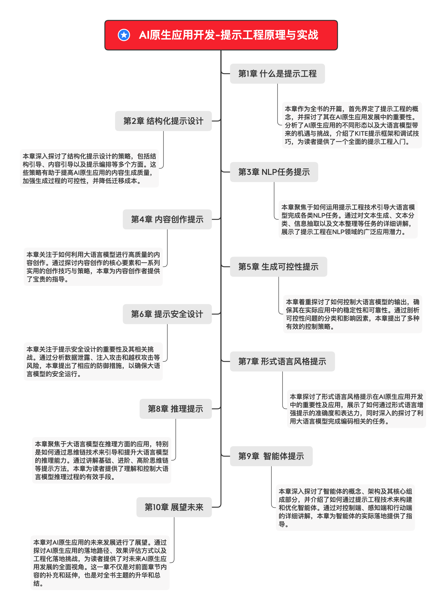

# AI原生应用开发-提示工程原理与实战

本书结合AI原生应用落地的大量实践，系统讲解提示工程的核心原理、相关案例分析和实战技巧，涵盖以下内容：提示工程概述、结构化提示设计、NLP任务提示、内容创作提示、生成可控性提示、提示安全设计、形式语言风格提示、推理提示、智能体提示等。

本书的初衷不是告诉读者如何套用各种预设的提示模板，而是帮助读者深入理解和应用提示设计技巧，以找到决定大语言模型输出的关键因子，进而将提示工程的理论知识应用到产品设计中。

本书适合AI原生应用开发的从业者和研究人员，以及人工智能相关专业的教师和学生阅读。

## 购买链接

| 购买渠道         | 购买链接   |
| ---------------- | ---------- |
| 京东（敬请期待） | 实体｜电子 |
| 当当（敬请期待） |            |

## 资源下载

©️在遵守[CC BY-SA 4.0](https://creativecommons.org/licenses/by-sa/4.0/)版权协议的前提下，转载与分享。

| 资源名称 | 查看地址                               |
| -------- | -------------------------------------- |
| 试读章节 | [前言](前言.md) [目录](前言.md)        |
| 全书配图 | [全书配图](全书配图.pdf)  [导图](导图) |
| 提示代码 | [在线查看](代码)                       |

## 学习导图

